<!-- Minimal Mermaid enable (page-local) -->
<script src="https://cdn.jsdelivr.net/npm/mermaid@10/dist/mermaid.min.js"></script>
<script>mermaid.initialize({startOnLoad:true, securityLevel:'loose'});</script>

This project demonstrates how to build an intelligent search layer using tool calling and building analytics layer on top of Uber receipts using **AWS Bedrock Agents** and **Elasticsearch**.

**Uber Receipts** from Gmail are parsed with **Google Apps Script** to extract structured trip details (pickup, drop-off, fare, duration, promotions, driver, etc.). These records are stored as **NDJSON** and ingested into an Elasticsearch index with semantic embeddings generated through the **Amazon Titan v2 embedding model**.

On top of this data, we enable:

* **Semantic search** using KNN queries on embeddings.
* **Aggregations and analytics** for metrics such as longest trip, highest fare, shortest distance, and frequent pickup/drop-off locations.
* **Time-based insights** including daily, monthly, and 30-minute travel windows with fare statistics.

An **AWS Bedrock Agent** acts as the conversational layer, **_for basic checks_**, you can even try with [Elasticsearch Playground](https://www.elastic.co/docs/solutions/search/rag/playground). It decides which Elasticsearch query or aggregation to run by function calling via the Lambda & bedrock model to  **FastAPI service**. Responses are then summarized naturally using **Claude 3 Haiku**, making it possible to ask open-ended questions like:

* Show me my last 5 trips in 2025.
* What was the most expensive trip I took last year?
* Which pickup location did I use most often?

-----

### Sequence Diagram

Here's the quick overview from `user perspective`:


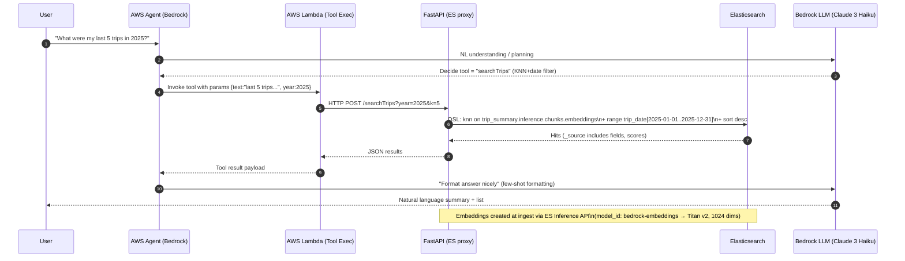

### Data Flow Chart

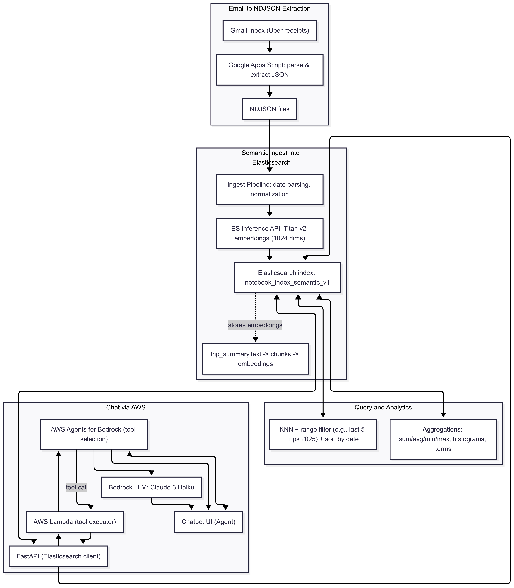

----

For AWS related dependencies, refer below:
- [openAPI Schema 3.0.0](docs/openapi_schema.aws_agent.json)
- [Lambda Python Code](src/lambda_function.py)
- [Lambda Requests Import](src/lambda_dependency_function.zip)
- [Prompt / Instructions to Agent](docs/prompt.aws_agent.md)

----

For Google Apps Script dependencies:

- [Google Apps Script Code to Extract Uber Receipt Data from GMail](src/google_apps_script.code.gs)

_Usage of Google Apps Script, makes it easy for everyone to extract data from GMail with just a simple UI/login authorization._

----

### Let's start from **Elasticsearch:**

- Start with Elastic Cloud, easy to start or you can make use of [start-local](https://www.elastic.co/docs/deploy-manage/deploy/self-managed/local-development-installation-quickstart#local-dev-prerequisites). For the demo purpose, I'm using Elasticsearch version `8.17.5`. 

- Once, Elasticsearch is up and running. We can make use of `semantic_text` field that generates the embeddings on the fly. To do that, [`text_embeddings`](https://www.elastic.co/docs/solutions/search/semantic-search/semantic-search-inference#infer-text-embedding-task) inference API.

To do that, you would need to create those `text_embeddings` tasks:

```
# embedding task
PUT _inference/text_embedding/bedrock-embeddings
 {
    "service": "amazonbedrock",
    "service_settings": {
        "access_key": "XXXXXXXXXXXXXXXXXXXXX",
        "secret_key": "XXXXXXXXXXXXXXXXXXXXXgLdX+jjuHk1o1bLMY",
        "region": "<appropriate_region>",
        "provider": "amazontitan",
        "model": "amazon.titan-embed-text-v2:0"
    }
}

# completion task
PUT _inference/completion/bedrock-completion
{
    "service": "amazonbedrock",
    "service_settings": {
        "access_key": "XXXXXXXXXXXXXXXXXXXXX",
        "secret_key": "QXXXXXXXXXXXXXXXXXXXXXdX+jjuHk1o1bLMY",
        "region": "<appropriate_region>",
        "model": "anthropic.claude-3-haiku-20240307-v1:0",
        "provider": "anthropic"
    }
}
```
Once, your inference endpoints are created. We are now good to import. 

- You can [ingest/load the NDJSON data](https://www.elastic.co/docs/explore-analyze/machine-learning/nlp/ml-nlp-text-emb-vector-search-example#ex-text-emb-data) to Elasticsearch (example.uber_trips.ndjson) from the GMail. Make sure, you sanitize your data(_test it before you upload or ingest to Elasticsearch_). While uploading the data, make sure to update the `@timestamp` == `pickup_timestamp` field so that it can plot the `dates` with `time window` accordingly.

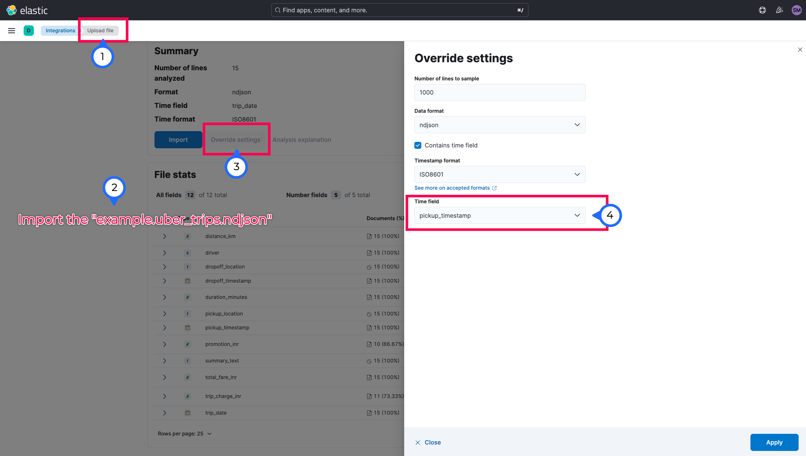

While importing, make sure to change the `index`(notebook_index_semantic_v1) creation to `Advanced` and update the below:

```
# mappings
{
  "properties": {
    "@timestamp": {
      "type": "date"
    },
    "distance_km": {
      "type": "double"
    },
    "driver": {
      "type": "keyword"
    },
    "dropoff_location": {
      "type": "text"
    },
    "dropoff_timestamp": {
      "type": "date",
      "format": "iso8601"
    },
    "duration_minutes": {
      "type": "long"
    },
    "pickup_location": {
      "type": "text"
    },
    "pickup_timestamp": {
      "type": "date",
      "format": "iso8601"
    },
    "promotion_inr": {
      "type": "double"
    },
    "summary_text": {
      "type": "text"
    },
    "total_fare_inr": {
      "type": "double"
    },
    "trip_charge_inr": {
      "type": "double"
    },
    "trip_date": {
      "type": "date",
      "format": "iso8601"
    },
    "trip_summary": {
      "type": "semantic_text",
      "inference_id": "bedrock-embeddings"
    }
  }
}
```

```
# ingest pipeline
{
  "description": "Ingest pipeline created by text structure finder",
  "processors": [
    {
      "date": {
        "field": "pickup_timestamp",
        "formats": [
          "ISO8601"
        ]
      }
    },
    {
      "set": {
        "field": "trip_summary",
        "copy_from": "summary_text"
      }
    }
  ]
}
```
_(Please note, it will take time to import and prior to import, make sure in the `Elasticsearch Relevance` page, you got the inference deployed)_

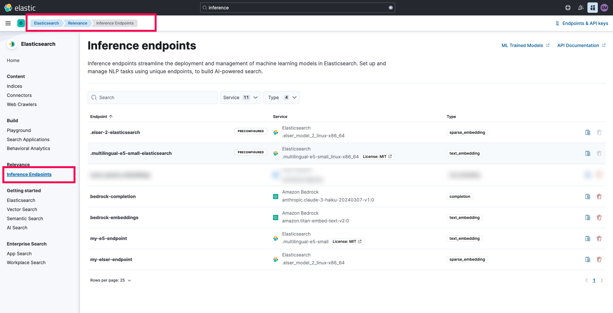

- You can also try the below query to test it:

```
# To get the mappings:
GET notebook_index_semantic_v1/_mapping
```

```
# To test the retrieval of the appropriate chunks and documents
GET notebook_index_semantic_v1/_search
{
  "knn": {
    "field": "trip_summary.inference.chunks.embeddings",
    "query_vector_builder": {
      "text_embedding": {
        "model_id": "bedrock-embeddings",
        "model_text": "last 5 trips in the year 2025"
      }
    },
    "k": 2,
    "num_candidates": 10
  },
  "query": {
    "bool": {
      "filter": {
        "range": {
          "trip_date": {
            "gte": "2025-01-01",
            "lte": "2025-12-31"
          }
        }
      }
    }
  },
  "_source": {
    "includes": ["trip_summary.text","distance_km","driver","duration_minutes","promotion_inr","total_fare_inr","trip_charge_inr","trip_date"]
  }
}
```

- Once the query is answered, let's get the [Personal API Key](https://www.elastic.co/docs/deploy-manage/api-keys/elasticsearch-api-keys#create-api-key) and [Elasticsearch Endpoint](https://www.elastic.co/docs/deploy-manage/deploy/cloud-enterprise/connect-elasticsearch#ece-connect-endpoint) and paste it in the [.env file](src/.env.example)

#### Quick Testing:

- You can test the capabilities of the `semantic search` using `Elasticsearch Playground`.

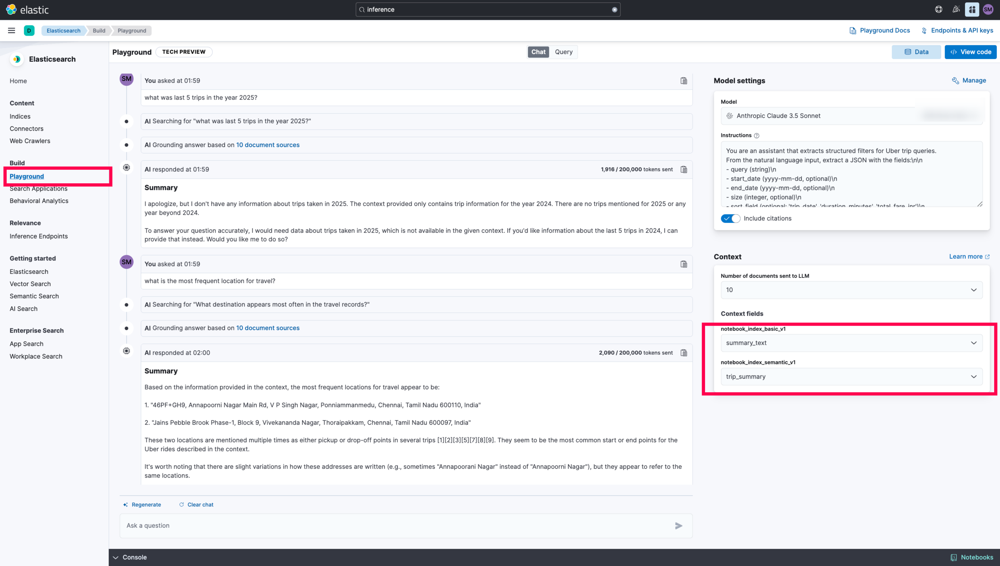

- The **limitation** of the playground is that the inability to optimize the queries or tune it accordingly. It's well suited for `Text interpretation` than `Analytics` type data.

- Now, this confirms that the setup on the `Elasticsearch` side is completed.

----

### NGROK Setup

- Login to [NGROK](https://ngrok.com/) and fetch the auth token and install ngrok aprpropriately. Make sure to paste it in the [.env file](src/.env.example)

----

### Start the FastAPI Application(triggers NGROK):

```
#1 python -m venv venv
#2 source venv/bin/activate    
#3 pip install -r requirements.txt
#4 cd src
#5 python main.py
```

```
# Expected Output

(venv) bedrock-agents-elasticsearch-demo % python main.py 
🚀 Public URL: https://1f92b42936a3.ngrok-free.app
INFO:     Started server process [59221]
INFO:     Waiting for application startup.
INFO:     Application startup complete.
INFO:     Uvicorn running on http://0.0.0.0:8000 (Press CTRL+C to quit)
INFO:     44.246.220.86:0 - "GET /topTrips/stats/totalDistance?date_lte=2025-12-31&date_gte=2025-01-01 HTTP/1.1" 200 OK
INFO:     44.246.220.86:0 - "GET /topTrips/stats/totalDistance?date_lte=2024-12-31&date_gte=2024-01-01 HTTP/1.1" 200 OK
INFO:     44.246.220.86:0 - "GET /searchTrips?sort_order=asc&date_lte=2025-01-31&size=5&model_text=first+5+trips+in+January+2025&date_gte=2025-01-01 HTTP/1.1" 200 OK
INFO:     44.246.220.86:0 - "GET /topTrips/byField?sort_order=desc&field=total_fare_inr&date_lte=2025-12-31&size=1&date_gte=2025-01-01 HTTP/1.1" 200 OK
INFO:     44.246.220.86:0 - "GET /topTrips/byField?sort_order=asc&field=duration_minutes&date_lte=2025-12-31&size=1&date_gte=2025-01-01 HTTP/1.1" 200 OK
```
#### API Endpoints

```
- /searchTrips
- /topTrips/byField
- /locations/pickup/top 
- /locations/dropoff/top
- /stats/frequentTimeIST
- /stats/fareStatsByTimeIST
- /topTrips/stats/totalFare
- /topTrips/stats/totalDuration
- /topTrips/stats/totalDistance
```

- Now, the `Fast API` is ready to serve.

-----

### AWS Setup

- Login to your AWS Account and the specific region. Go to AWS Bedrock. Make sure, you have `IAM Permissions` set to use the `Bedrock Agents`.

- Create a `Bedrock Agent`.

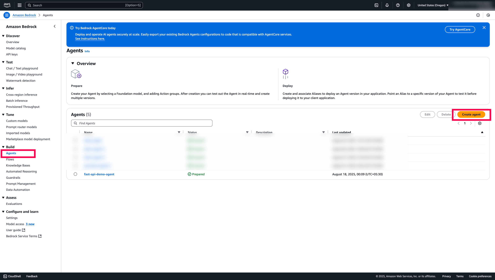

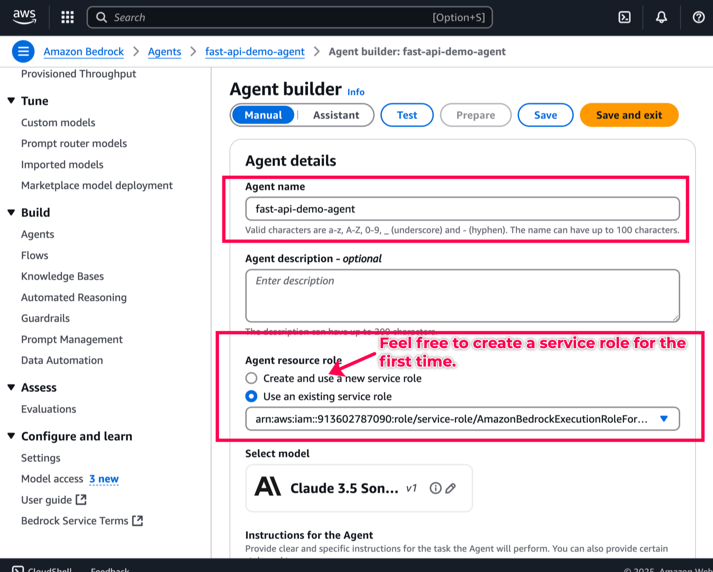

- Under Instructions for the Agent, copy-paste this [prompt](docs/prompt.aws_agent.md).

- Add a new `Action Groups` with the `openAPI schema` and the `Lambda function`.

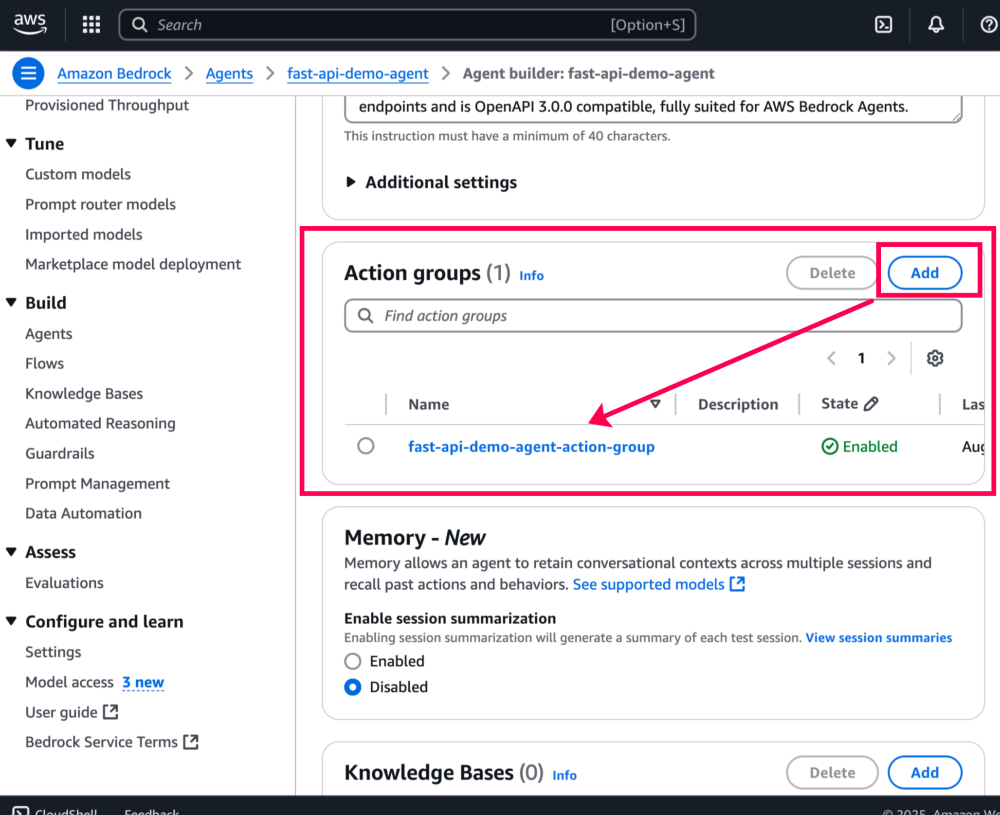

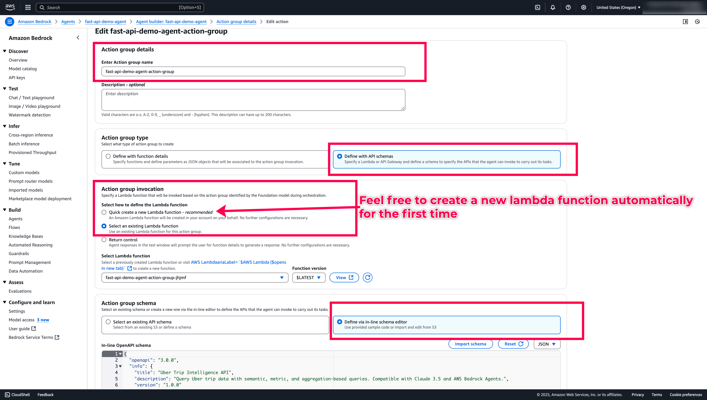

- Copy-paste the `openAPI Schema 3.0.0` from [here.](docs/openapi_schema.aws_agent.json) and save the Agent Buider.

- Now, the Agent Builder, create a new Lambda function for us. Let's go to `AWS Lambda` and `update the code` as [here.](src/lambda_function.py).

- Also, as the [`requests` dependencies](src/lambda_dependency_function.zip) are unvailable, I have bundled it so, we can directly import it from Lambda and finally, deploy the Lambda code. Make sure to update the `NGROK` Public Url.

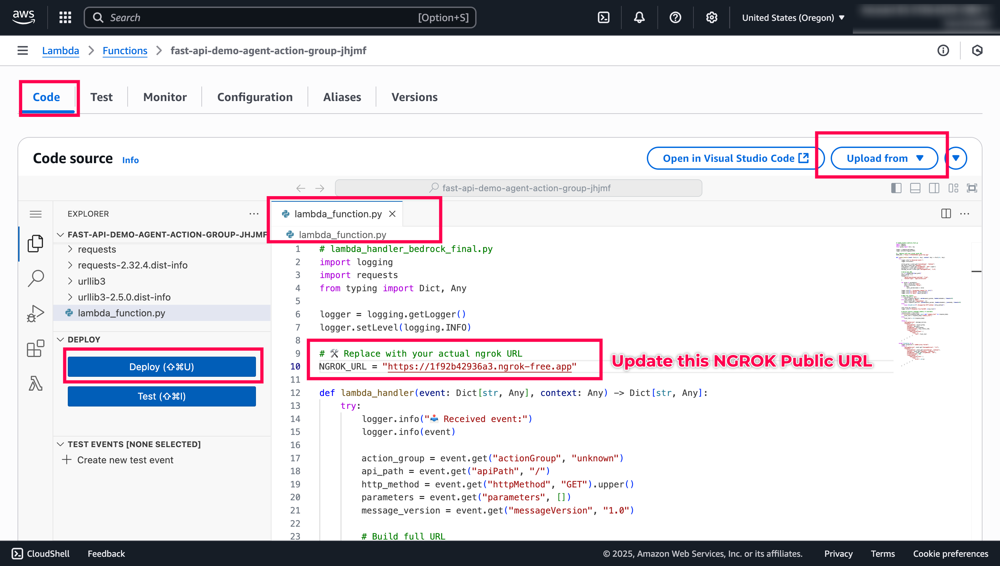

_**Quick Tip: Enable Cloudwatch logs to understand what's happening in the Lambda side**_

- Once, Lambda is deployed successfully, you can go back to Agent Builder and please hit `save`, let it load for a couple of seconds and hit `Prepare` to `Test` the agent.

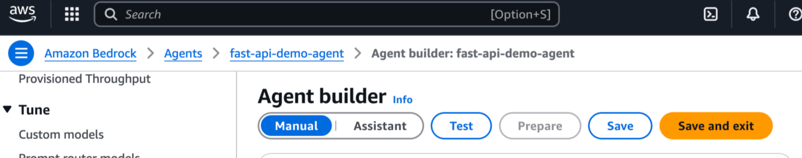

- Now, let's ask the questions to test the agent.

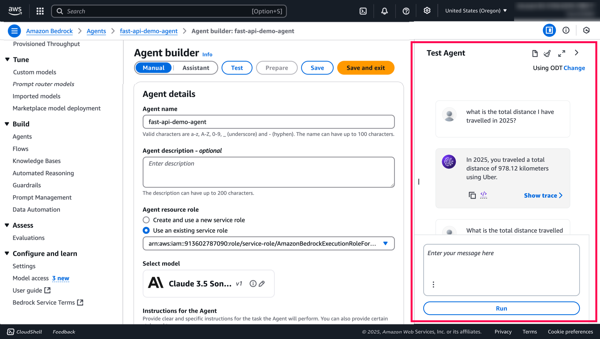
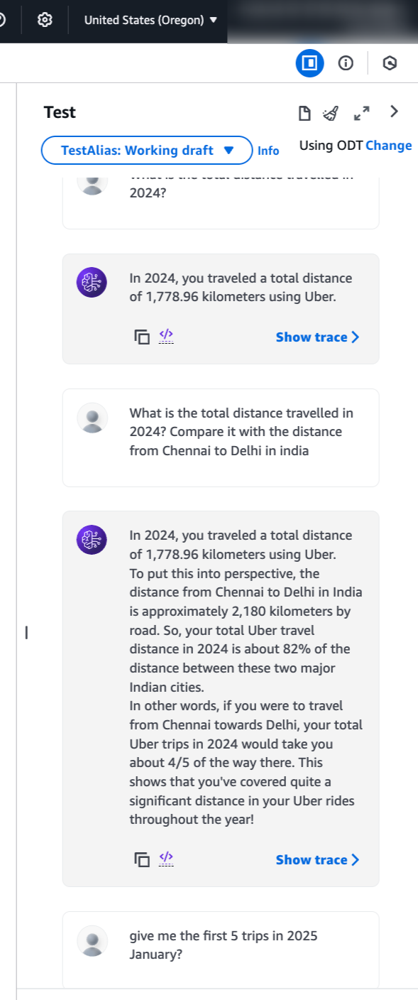

- That's it. Start to play around with the questions on the Uber trips and try to modify the Fast APIs and queries. You can check the logs in the `Python Fast API application` as well.

-----

### Additional References:

- Basic Queries to test in Kibana DevTools, refer [queries.md](docs/queries.md).

----